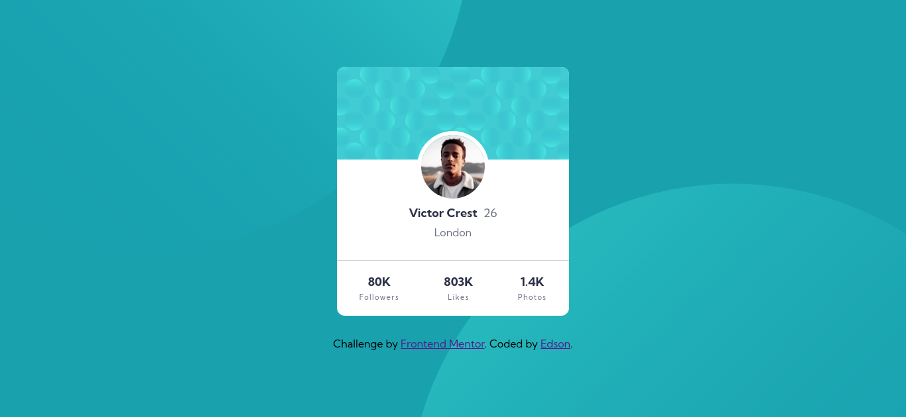

# ✨ Frontend Mentor - Profile card component solution ✨



---

### 🧾 Sobre

Essa é uma solução para [Profile card component challenge on Frontend Mentor](https://www.frontendmentor.io/challenges/profile-card-component-cfArpWshJ). Os desafios do Frontend Mentor ajudam você a melhorar suas habilidades de codificação criando projetos realistas.

---

### 🚀 Tecnologias utilizadas

-   Html
-   Css
-   Padronização BEM
-   Flexbox

---

### 📖 O que eu aprendi

Durante o desenvolvimento do desafio, eu aprendi como posicionar duas imagens - uma no canto inferior direito e a outra no canto superior esquerdo.

```css
body {
    background-position: right 48vw bottom 40vh, left 45vw top 44vh;
}
```

---

### 👨‍💻 Desenvolvimento contínuo

Pretendo utilizar códigos padronizados à BEM, pois facilita a leitura do código HTML e CSS. Além disso, evita que aconteça conflitos de estilos. Além disso, pretendo aperfeiçoar o entedimento sobre o posicionamento de imagens.

---

### 🤝 Recursos úteis

-   [BEM](https://en.bem.info/methodology/quick-start/) - Isso me ajudou a deixar o CSS fácil de ler. Gostei muito deste modelo e vou usá-lo daqui para frente.
-   [Flexbox](https://origamid.com/projetos/flexbox-guia-completo/) - Este é um site incrível que me ajudou a finalmente entender Flexbox. Eu recomendo para quem ainda está aprendendo este conceito.
-   [Background-position](https://developer.mozilla.org/en-US/docs/Web/CSS/background-position) - Este é um site incrível para entender sobre os positionamentos de imagems. Eu recomendo para quem ainda está aprendendo este conceito.

---

### 🤗 Agradecimentos

Esse projeto, como ajuda para o posicionamento de imagens eu utilizei esse vídeo incrível: [Background-position](https://www.youtube.com/watch?v=NZpG9EBKYWc).

---

### 〽️ Getting started

```zsh
    # Clonando o repositório em sua máquina
    $ git clone https://github.com/edsonjaguiar/Profile-card-component
```
